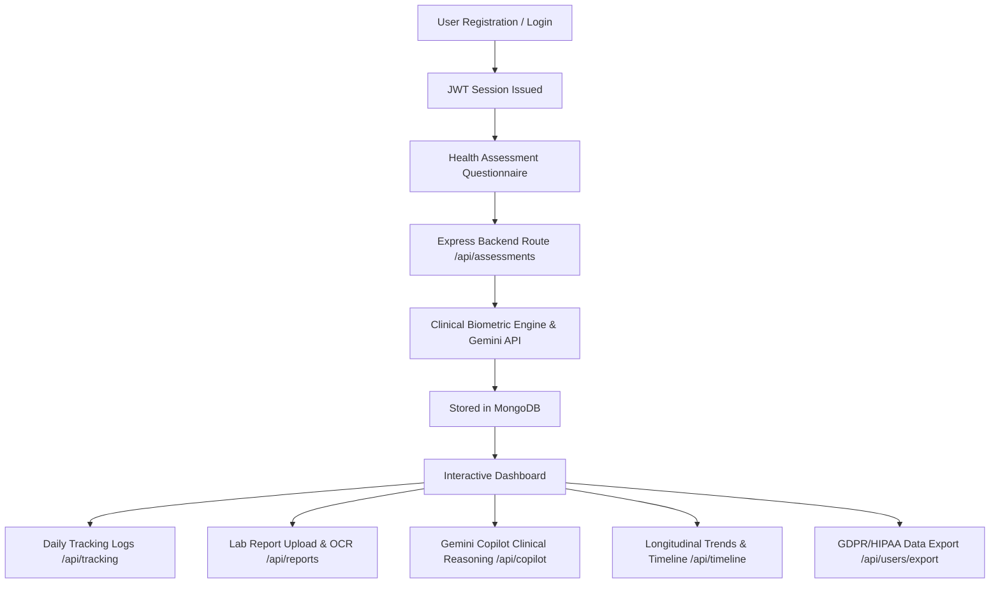

# GeneGuard AI

## Predict Tomorrow's Health, Today.

**GeneGuard AI** is an enterprise-grade preventive health intelligence platform designed to empower individuals with clinical-grade biometric analytics, AI-driven risk modeling, and genomic health intelligence. By synthesizing user-reported lifestyle factors, longitudinal daily tracking vitals, hereditary risk metrics, and diagnostic laboratory panels through **Google Gemini AI**, GeneGuard AI delivers proactive, actionable prevention protocols before clinical symptoms emerge.

---

> ⚠️ **Clinical & AI Disclaimer**  
> GeneGuard AI provides educational wellness insights, risk stratifications, and preventive health guidance. It is **not** a substitute for professional medical advice, clinical diagnosis, or treatment. Always consult a qualified healthcare provider regarding medical conditions.

---

## ✨ Features

- 🧬 **Comprehensive Health Assessment** — Multi-step clinical questionnaire capturing lifestyle, biometrics, organ systems, and hereditary predispositions with real-time risk scoring.
- 🤖 **AI Clinical Assistant & Copilot** — Conversational clinical intelligence powered by Google Gemini, capable of answering contextual health questions referencing your authenticated assessments, active goals, and lab panel histories.
- 📊 **Dynamic Health Scoring & Biometric Breakdown** — Real-time aggregate health score (0–100) and multi-dimensional analysis across Cardiovascular, Metabolic & Glucose, Neurological, Immunity & Inflammation, and Pharmacogenomic Response.
- 📋 **Diagnostic Lab Report Analysis** — Upload PDF and image laboratory panels (CBC, Lipid Panel, Metabolic Panel, Endocrine) with automated biomarker extraction, reference range validation, and structured clinical summaries.
- 📈 **Longitudinal Report Comparison** — Side-by-side delta analysis tracking biomarker improvements, regressions, and clinical trajectories over time.
- 📅 **Daily Health Tracking** — Log and monitor daily vitals including hydration, sleep duration and quality, exercise intensity, resting heart rate, blood pressure, fasting glucose, and mood.
- 🎯 **Preventive Health Goals** — Set, track, and achieve actionable SMART health milestones with automated progress recalculation.
- 🗓️ **Preventive Care Calendar** — Interactive schedule for age-appropriate health screenings, routine laboratory checkups, and preventive vaccinations.
- 👨‍👩‍👧‍👦 **Family Health & Hereditary Factors** — Track familial health histories to map multi-generational risk vectors.
- 📜 **Longitudinal Health Timeline** — Chronological audit trail of health milestones, lab reports, assessment results, and clinical notes.
- 🔒 **GDPR & HIPAA Data Portability** — One-click complete health record export in JSON and CSV formats with selective module purging and password-protected account deletion.
- 👑 **Administrative Management Console** — Secure dashboard for platform health telemetry, user role management, system metrics, and audit logs.
- 🌓 **Semantic Light & Dark Mode** — Polished, high-contrast healthcare SaaS UI with smooth theme switching and persistent preferences.
- 📱 **Adaptive Collapsible Navigation** — Responsive sidebar supporting expanded and icon-only collapsed desktop states, plus a mobile slide-in drawer.

---

## 🛠 Technology Stack

### Frontend
- **Framework**: React 19 + TypeScript
- **Bundler & Tooling**: Vite 6
- **Styling**: Tailwind CSS v4 (`@tailwindcss/vite`)
- **Routing**: React Router DOM v7 (Public, Protected, and Admin Route Guards)
- **Forms & Validation**: React Hook Form
- **Animations**: Framer Motion
- **Data Visualization**: Recharts (Area, Pie, Bar, Radar, and Radial charts)
- **Icons**: Lucide React
- **HTTP Client**: Axios (with Bearer token interceptor and 401 recovery)

### Backend
- **Runtime**: Node.js (ES Modules)
- **Framework**: Express.js
- **Execution & Transpilation**: TypeScript (`tsx` in dev, `tsc` in prod)
- **Database & ODM**: MongoDB with Mongoose
- **AI Engine**: Google Gemini API (`@google/generative-ai`) with deterministic Clinical Fallback Intelligence
- **File Processing**: Multer for PDF/image lab document uploads
- **Security & Middleware**:
  - `helmet` (Security headers & CORS policies)
  - `express-mongo-sanitize` (NoSQL injection defense)
  - `express-rate-limit` (Dedicated auth, general API, and AI rate limiting)
  - `bcryptjs` (Password hashing with 12 salt rounds)
  - `jsonwebtoken` (Stateless JWT authentication)

---

## 📁 Project Structure

```
GENEGUARD AI/
├── client/                           # React Frontend Application
│   ├── public/
│   │   └── manifest.json             # Web App Manifest
│   ├── src/
│   │   ├── components/
│   │   │   ├── charts/               # Health score and biometric Recharts
│   │   │   ├── features/             # Modals, report upload, disclaimer banners
│   │   │   ├── layout/               # Layouts, Navbar, DashboardLayout, Footer
│   │   │   │   └── Sidebar/          # Collapsible Sidebar components
│   │   │   └── ui/                   # Reusable UI primitives (Button, Input, Card, Modal)
│   │   ├── context/                  # AuthContext, ThemeContext, ToastContext, SidebarContext
│   │   ├── hooks/                    # useAuth, useTheme, useToast, useDebounce
│   │   ├── pages/                    # 18 SPA Route Pages
│   │   │   ├── Achievements/         # Gamified preventive health milestones
│   │   │   ├── Admin/                # Administrator management dashboard
│   │   │   ├── Analysis/             # Health score breakdowns & longitudinal charts
│   │   │   ├── Assessment/           # Health questionnaire & result views
│   │   │   ├── Auth/                 # Login, Register, Forgot Password
│   │   │   ├── Calendar/             # Preventive health screening calendar
│   │   │   ├── Chat/                 # General conversational assistant
│   │   │   ├── Copilot/              # Contextual Gemini clinical assistant
│   │   │   ├── Dashboard/            # Primary user health command center
│   │   │   ├── Family/               # Hereditary risk assessment
│   │   │   ├── Genetics/             # Genetic variant & predisposition explorer
│   │   │   ├── Goals/                # SMART health goals tracking
│   │   │   ├── Landing/              # Public product landing page
│   │   │   ├── NotFound/             # 404 handler
│   │   │   ├── Profile/              # User profile & demographic preferences
│   │   │   ├── Recommendations/      # Curated clinical habits & diet protocols
│   │   │   ├── Reports/              # Lab report upload, viewer, and comparison
│   │   │   ├── Settings/             # GDPR export, data purge, theme settings
│   │   │   ├── Timeline/             # Longitudinal health milestones
│   │   │   ├── Tracking/             # Daily vitals and habits logging
│   │   │   └── WeeklyReport/         # AI-generated weekly health syntheses
│   │   ├── services/                 # Axios API services
│   │   ├── styles/                   # Global Tailwind CSS and theme tokens
│   │   ├── types/                    # Core TypeScript interfaces
│   │   ├── utils/                    # Validation, formatters, and constants
│   │   ├── App.tsx                   # Route definitions and application shell
│   │   └── main.tsx                  # React DOM mount point
│   ├── index.html
│   ├── package.json
│   ├── tsconfig.json
│   └── vite.config.ts
│
├── server/                           # Express Backend Application
│   ├── src/
│   │   ├── config/                   # MongoDB connection, env loader, Gemini init
│   │   ├── controllers/              # 18 Express route controllers
│   │   ├── middleware/               # Auth, Admin guard, Rate limiters, Error handler
│   │   ├── models/                   # 12 Mongoose data schemas
│   │   ├── routes/                   # RESTful API route endpoints
│   │   ├── services/                 # Gemini AI, scoring, timeline, admin sync
│   │   ├── utils/                    # Clinical calculation engines, AI safety checks
│   │   └── index.ts                  # Server entry point and middleware pipeline
│   ├── uploads/                      # Uploaded medical lab panel documents
│   ├── test-ai-workflow.js           # Automated test suite for AI analysis
│   ├── test-validation.js            # Automated test suite for schema validation
│   ├── package.json
│   └── tsconfig.json
│
├── .gitignore
└── README.md
```

---

## 🚀 Installation & Setup

### Prerequisites
- **Node.js**: v18.0.0 or higher
- **MongoDB**: Local MongoDB community server (`mongodb://localhost:27017`) or MongoDB Atlas URI
- **Google Gemini API Key**: Obtainable from [Google AI Studio](https://aistudio.google.com/app/apikey)

### 1. Clone Repository
```bash
git clone https://github.com/PavanRameshMalthi/GENEGUARD-AI.git
cd GENEGUARD-AI
```

### 2. Configure Backend Environment
Navigate to `server/` and create your `.env` file:
```bash
cd server
cp .env.example .env
```

Edit `server/.env`:
```env
PORT=5000
MONGODB_URI=mongodb://localhost:27017/geneguard
JWT_SECRET=your_super_secret_jwt_key_here
GEMINI_API_KEY=your_google_gemini_api_key_here
CLIENT_URL=http://localhost:5173
ADMIN_EMAIL=admin@example.com
```

Install dependencies:
```bash
npm install
```

### 3. Configure Frontend Environment
Navigate to `client/` and create your `.env` file:
```bash
cd ../client
cp .env.example .env
```

Edit `client/.env`:
```env
VITE_API_URL=http://localhost:5000/api
```

Install dependencies:
```bash
npm install
```

---

## 💻 Running the Application

### Start Backend Development Server
```bash
cd server
npm run dev
```
> Server will initialize on `http://localhost:5000`.

### Start Frontend Development Server
```bash
cd client
npm run dev
```
> Client will launch at `http://localhost:5173`.

---

## 🏗️ Production Build

### Compile Backend
```bash
cd server
npm run build
npm start
```

### Compile Frontend
```bash
cd client
npm run build
npm run preview
```

---

## 🔄 Application Architecture & Data Flow



---

## 🛡️ Security & Privacy Architecture

- **Stateless Authentication**: Signed JSON Web Tokens (JWT) stored client-side in secure storage with strict Authorization headers.
- **Double-Click & Brute-Force Rate Limiting**: Multi-tiered rate limiting via `express-rate-limit` with isolated authentication quotas (`skipSuccessfulRequests: true`) to prevent denial-of-service lockout.
- **Injection Protection**: Comprehensive NoSQL query sanitization via `express-mongo-sanitize` on all incoming request payloads.
- **AI Safety Filter**: Integrated detection for urgent/emergency symptoms that immediately triggers emergency guidance modals rather than generic responses.
- **Granular Data Ownership**: Complete user-controlled data portability with JSON and CSV exports and irreversible single-module or full-account purges.

---

## 🔮 Future Scope

- ⌚ **Wearables & IoT Integration** — Direct synchronization with Apple HealthKit, Google Health Connect, and continuous glucose monitors (CGMs).
- 🧬 **Next-Gen Genomic Importers** — Direct raw DNA file parsing (.vcf, 23andMe, AncestryDNA) for deeper pharmacogenomic insights.
- 🎙️ **Voice-Activated Health Logging** — Multi-modal voice interaction for logging daily vitals hands-free.
- 👨‍⚕️ **Clinician Telehealth Bridge** — Encrypted physician portal enabling secure sharing of AI report comparisons with healthcare providers.

---


---

## 📄 License

This project is licensed under the **MIT License**.
=======
